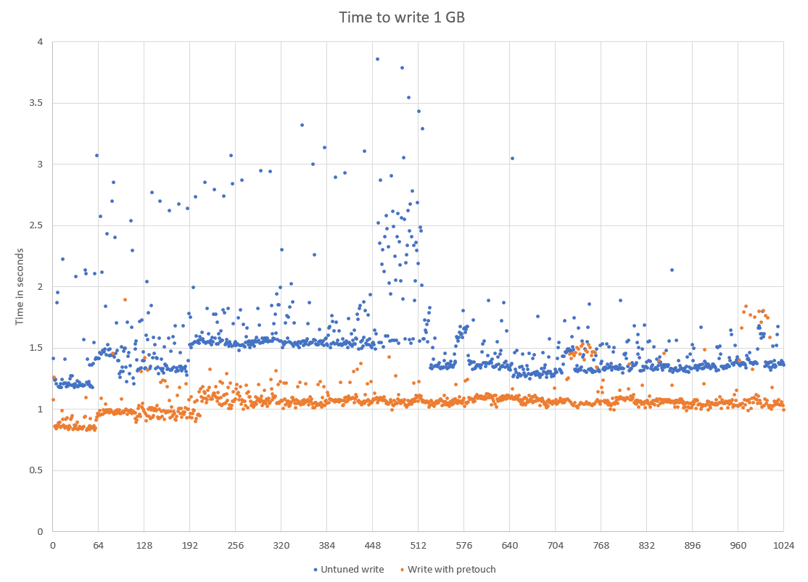

= Chronicle Queue Pre-toucher
Neil Clifford

:css-signature: demo

Chronicle Queue uses a pre-toucher mechanism to greatly improve write performance.

During the write process there is significant write-speed variation, as the process has to find new memory to write to. This can be mitigated by using the Chronicle `pretouch()` call to pre-allocate writeable memory. 

The pre-toucher can be enabled with the Chronicle Queue Builder using:

```
<SingleChronicleQueueBuilder>.enablePreloader(<pretouchIntervalMillis>) ;
```

The graph below shows the comparative speeds between using, and not using, the pre-toucher.



NOTE: Normally, this would be run in a background thread, but for the purposes of the performance test shown above it was run in the same thread but not timed.

'''
<<../README.adoc#,Back to ReadMe>>
