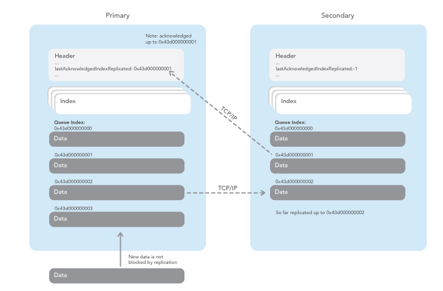

= Replication (Enterprise Edition Feature)
Neil Clifford
:toc: macro
:toclevels: 1
:css-signature: demo
:toc-placement: macro
:icons: font

toc::[]

Chronicle Queue replicates Chronicle Queue messages over TCP/IP, from the `PRIMARY` to the `SECONDARY` to provide real-time back-up of your Chronicle queues.

Chronicle Queue automatically performs replication if the `chronicle-queue-enterprise.jar` is available in your class path, and you have set up a cluster in the `cluster.yaml` configuration file.

NOTE: For more information on obtaining the `chronicle-queue-enterprise.jar` please contact mailto:sales@chronicle.software[sales@chronicle.software].

Chronicle Queue replication works by replicating all messages from the `PRIMARY` queue to the `SECONDARY` queue.

IMPORTANT: Chronicle requires exclusive write access to the `SECONDARY`. You should treat the `SECONDARY` as read-only, and not attempt to manually write messages.

== Queue header
The Chronical Queue header is structured as follows:

[source, java]
----

--- !!meta-data #binary
header: !SCQStore {
  wireType: !WireType BINARY_LIGHT,
  writePosition: 524744,
  roll: !SCQSRoll {
    length: !short 1000,
    format: yyyyMMdd-HHmmss,
    epoch: 0
  },
  indexing: !SCQSIndexing {
    indexCount: !int 32768,
    indexSpacing: 4,
    index2Index: 385,
    lastIndex: 4
  },
  lastAcknowledgedIndexReplicated: -1,
  recovery: !TimedStoreRecovery {
    timeStamp: 0
  },
  deltaCheckpointInterval: 0
}
----
`lastAcknowledgedIndexReplicated` is set to `-1` when

- replication is not being used, or

- no replication acknowledgment has yet been received from the other host.

`lastAcknowledgedIndexReplicated` will be automatically set to the index position of the latest acknowledged message.

== Tiered Indexing
Chronicle Queue uses tiered multi-level indexing to provide a fast and efficient method for searching for messages in a large queue.

=== Primary index
----
# position: 385, header: -1 #  <1>
--- !!meta-data #binary
index2index: [ #  <2>
  # length: 32768, used: 1
  262568, #  <3>
  0, 0, 0, 0, 0,
]
<1> `position` specifies the starting address of the data that follows, within the the queue (*.cq4) file.

<2> `index2Index` defines a pointer to the next lower level of index.

<3> specifies the point to the next level index.

NOTE: In this way, indexes can be tiered (primary, secondary, tertiary, etc.) as required to enhance indexing speed and efficiency.
----

=== Final level index

----
# position: 262568, header: -1 #  <1>
--- !!meta-data #binary
index: [ #  <2>
  # length: 32768, used: 1
  524744, #  <3>
  0, 0, 0, 0, 0, 0, 0, 0,
]
----
<1> `position` specifies the point in the queue.

<2> `index` defines a pointer to the data.

<3> specifies the point in the queue where the data begins.

=== Data location

----
# position: 524744, header: 0 #  <1>
--- !!data #binary #  <2>
"": some more text
...
# 785952 bytes remaining

----
<1> `position` specifies the point in the queue where the data begins.

<2> `data` defines the following information is data (`--- !!data #binary #`) rather than than meta data (`--- !!meta-data #binary`).

== Configuration File

The host in a cluster are defined in a YAML configuration file. This configuration file below, has just two hosts, but there is no fixed limit to the number of hosts you could include, ultimately it is limited by your hardware resources.

Each host is a running an instance of Chronicle. When using Chronicle Queue Enterprise Edition, these engines are likely to each contain a Chronicle queue. In this example below there are two hosts, one running on `localhost:8080`, and the other on `localhost:8081`. The hosts are on the same machine; in a real life example, these hosts would usually be on different machines.

NOTE: The examples given below perform queue replication using established interfaces that are based on the open source Chronicle Engine API.

[source, yaml]
----

cluster: {
  context: !EngineClusterContext {
  }
  host1: {
     hostId: 1,
     tcpBufferSize: 65536,
     connectUri: localhost:8080,
     timeoutMs: 5000,
  },
  host2: {
     hostId: 2,
     tcpBufferSize: 65536,
     connectUri:  localhost:8081,
     timeoutMs: 5000,
  }
}
----

== Host ID

When adding a host, you must provide a unique ID for each host; we refer to this ID as the `hostId`. The `hostId` must be a integer, from `1` to `MAX_INTEGER`.

[source, yaml]
----
  host: {
     hostId: <unique id>,
  }
----

It is important that this `hostId` is unique as it is used by Chronicle Engine clustering. For Queue replication, by default, the host with `hostID` of `1` is assumed to be the PRIMARY, and the other hostids are assumed to be the SECONDARYs.

== Creating an instance of the `ChronicleQueueView`

The following code is an example of how to create an instance of a host.

[source, java]
----
final AssetTree tree = new VanillaAssetTree((byte) hostId)
                .forTesting()
                .withConfig(resourcesDir() + "/config", OS.TARGET + "/" + hostId);

final Asset queue = tree.root().acquireAsset("the/uri");

queue.addLeafRule(QueueView.class, LAST + "chronicle queue", (context, asset) -> {
    try {
        return new ChronicleQueueView(context.wireType(writeType).cluster(clusterName)
                .elementType(context.elementType()).messageType(context.messageType()), asset);
    } catch (IOException e) {
        throw Jvm.rethrow(e);
    }
});

// change the host/port to either localhost:8080 or localhost:8081 depending on which host you are running
ServerEndpoint serverEndpoint = new ServerEndpoint("localhost:8080", tree);
----

The code above:

- sets up Chronicle on port `localhost:8080`.
- uses the configuration file shown. This configuration file should be stored at `config/etc/clusters.yaml`.
- configures an asset on the Chronicle Engine asset tree at `/the/uri` with a `leafRule`. This `leafRule` is setup to provide a `ChronicleQueueView` when asked for a `ChronicleQueue`. The `ChronicleQueueView` is an implementation of the `ChronicleQueue` interface.

Assuming that both `host1` and `host2` instances of Chronicle Engine were run with the same java code above, then messages added to the chronicle queue on `host1` would be replicated to `host2`.

The interface of the `ChronicleQueueView`, is as follows:

[source, java]
----
public interface QueueView<T, M> extends TopicPublisher<T, M>, KeyedView {

    /**
     * returns a {@link Excerpt} at a given index
     *
     * @param index the location of the except
     */
    @Nullable
    Excerpt<T, M> get(long index);

    /**
     * the next message from the current tailer which has this {@code topic}
     *
     * @param topic next excerpt that has this topic
     * @return the except
     */
    Excerpt<T, M> get(T topic);

    /**
     * Publish to a provided topic.
     *
     * @param topic   to publish to
     * @param message to publish.
     * @return the index in the chronicle queue the excerpt
     */
    long publishAndIndex(@NotNull T topic, @NotNull M message);

    interface Excerpt<T, M> {
        T topic();

        M message();

        long index();

        void clear();
    }

    interface Tailer<T, M> {
        /**
         * @return the next message from the current tailer
         */
        @Nullable
        Excerpt<T, M> read();
    }
}
----

== Definitions

|=======
|`Excerpt`| In Chronicle we refer to messages as excerpts.
|`PRIMARY`   | The master of the messages; messages are replicated from the PRIMARY to the SECONDARY.
|`SECONDARY`    | The receiver of the messages; holds an real-time up-to-date copy of the PRIMARY's data.
|=======

'''

<<../README.adoc#,Back to Chronicle Queue>>
