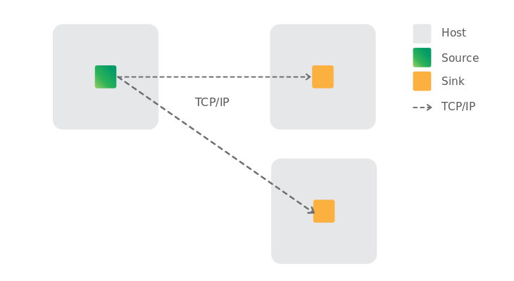

=  Queue Replication
:toc:
:toc-title: Contents
:toclevels: 2

== Chronicle Queue Enterprise Replication

Chronicle Queue Enterprise replication performs simple uni-directional, multi-way replication by copying a Chronicle Queue from one host, to one or more other hosts using TCP/IP.

.Chronicle Queue Replication


=== Replication protocol overview

See link:queue-replication-message-protocol-overview.adoc[Replication Protocol Overview]

=== The mechanics of Chronicle Queue Replication

The queue that we write to is known as the `source` queue. The copy(ies) is the `sink` queue.

IMPORTANT: Chronicle requires exclusive write access to the `sink`, and in fact locks it so that nothing else can write to it.

If we allowed messages to be written to the sink, it is easy to imagine a case where different messages are written to a `source` and `sink` at the same time. The messages on the `source` queue and `sink` queue could now be in a very different order. Because of this situation we do not allow messages to be written to the `sink` queue, Queues must maintain message ordering, and ensure that the `source` queue and `sink` queue are identical.

One of the reasons that we enforce this is that, in a microservices architecture, in order that you can get true 'replay-ability', you should be able to guarantee the consistency, and ordering, of the messages in queues. Therefore, any service that is running on the `source` machine must receive the same events, and in the same order, as the service running on the `sink` machine.

Any message that is written to the `source` is copied to the `sink`. The `sink` therefore becomes a mirror image of the `source`.

At startup, replication locks the `source` queue, and waits for the `sink`(s) to report the number of records it has. If the `sink` has more records, they are replayed back to `source` before it is unlocked and made usable again. This is done to provide automatic data re-synchronisation after a failover to the `sink`.

The set of hosts onto which the queue is replicated, is defined as a `cluster`. The configuration for a cluster is as follows:

```
!QueueReplicationCfg {
  cluster: {
    context: !QueueClusterContext {
      heartbeatIntervalMs: 300000,
      heartbeatTimeoutMs: 500000,
      baseSourcePath: "replica/source",
      baseSinkPath: "replica/sink",
    }

    host1: {
      hostId: 1,
      connectUri: host.port1,
    }
    host2: {
      hostId: 2,
      connectUri: host.port2,
    }
    ...
  },

  queues: {
    queue1: {
      path: "queue1",
      acknowledge: false,
      masterId: 1,
    }
  }
}
```

In the configuration shown above, the queue, `queue1`, is set to be replicated from `host1`
(as indicated by `masterId`) to all other hosts defined for the cluster, without acknowledgement.

Queues will use storage paths defined by `baseSourcePath` and `baseSinkPath` for `source` and `sink`, respectively, followed by the queue name. For this example, the `source` queue will be at `replica/source/queue1`, while the `sink` will be written to `replica/sink/queue1`.

=== Using Enterprise Queue Replication

To start replicating data, the user must create an instance of `ReplicatedQueue` for each host. This is done as follows:

```
ReplicatedQueue repl = new ReplicatedQueue(config(), hostId);
repl.startReplication();
...
// shutdown
repl.shutdown();
```

==== Example from a test case

[source,java]
```
@Test
public void shouldReplicate() throws Exception {

    YamlLogging.setAll(false);
    IOTools.deleteDirWithFiles("replica", 10);
    TCPRegistry.createServerSocketChannelFor(
            "host.port1",
            "host.port2",
            "host.port3");

    startupHost((byte) 1);
    startupHost((byte) 2);

    ReplicatedQueueCfg qCfg = CONFIG.queues().values().stream().filter(q -> q.path.equals("queue1")).findFirst().orElseGet(() -> {
        fail("Queue queue1 not found");
        return null;
    });
    QueueClusterContext ctx = CONFIG.cluster().clusterContext();
    assert ctx != null;
    SingleChronicleQueue source = QueueBuilderFromConfig.queueFromConfig(qCfg, CONFIG::queueConfig, path -> ctx.getSourcePath(path, (byte) 1));
    SingleChronicleQueue sink = QueueBuilderFromConfig.queueFromConfig(qCfg, CONFIG::queueConfig, path -> ctx.getSinkPath(path, (byte) 2));

    ExcerptTailer tailer = sink.createTailer();

    assertNull(poll(tailer, 200L));

    ExcerptAppender appender = source.acquireAppender();

    try (DocumentContext dc = appender.writingDocument()) {
        dc.wire().write("test").text("Hello replica");
    }

    String poll = poll(tailer);
    assertEquals("Hello replica", poll);

    try (DocumentContext dc = appender.writingDocument()) {
        dc.wire().write("test").text("Hello replica2");
    }

    poll = poll(tailer);
    assertEquals("Hello replica2", poll);

    poll = poll(tailer, 500L);
    assertNull(poll);
}
```

=== Replication acknowledgement modes

Replication can be configured to send replication messages with or without acknowledgement. This is
controlled with the `software.chronicle.enterprise.queue.config.ReplicatedQueueCfg.acknowledge` property.

If the `acknowledge` property is set to false, then replication will proceed as quickly as possible,
with no acknowledgement from the sink(s). Chronicle Queue Enterprise replication will take advantage
of the underlying protocol to ensure correct ordering. Chronicle Queue Enterprise replication can use
either TCP or an optimised custom protocol over UDP.

The source queue itself keeps track of

* `net.openhft.chronicle.queue.impl.single.SingleChronicleQueue.lastIndexReplicated()` - this is the maximum index that
has been sent to any and all remote hosts.
* `net.openhft.chronicle.queue.impl.single.SingleChronicleQueue.lastAcknowledgedIndexReplicated()` - this is the maximum
index that has been acknowledge received by any and all remote hosts. If `ReplicatedQueueCfg.acknowledge` is false
then this will always be -1.

A source queue can be set up with a possible three modes of operation:

==== Replicate as soon as possible
This is the default configuration for replication and is configured by setting
`software.chronicle.enterprise.queue.config.ReplicatedQueueCfg.acknowledge` false, and no
custom config on tailers or appenders.

==== Local tailer will only see messages which have been replicated
This is enabled with `net.openhft.chronicle.queue.ExcerptTailer.readAfterReplicaAcknowledged(boolean)`
and setting this to true on a source queue ensures that the tailer will not read until at least one of
the sinks has acknowledged receipt of the excerpt. This will block forever if no sinks acknowledge receipt.

==== Appender doesn't return until a replica has acknowledged it has been received.
This can be achieved after committing a write (e.g. closing `DocumentContext`) by this loop
```
while (appender.lastIndexAppended() < appender.queue().lastAcknowledgedIndexReplicated())
    ;
```

== Q/As

=== Question

If the Chronicle-Queue is cleared in the primary host, will this be replicated in the secondary?

=== Answer

There's no such thing as clearing the queue (it's unsupported). So you can manually delete the files, but that will have unpredictable results if you don't recreate your queues and don't restart your process.
The queue is append-only, and replication works in append-only manner, that is, it will never ever delete anything. It will continue replication from where it left off which is determined by the entry index, which means, if you delete the files for the previous roll cycles, it will not even notice it. However if you delete the file for the current cycle and then later recreate it without deleting the corresponding file on the other host - you will lose data, as the same index in the primary queue will correspond to old entries in the secondary queue.

'''

<<../README.adoc#,Back to Chronicle Queue>>
