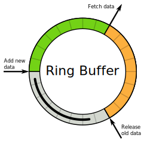

= Ring Buffer
:toc:
:toc-title: Contents
:toclevels: 1

== Chronicle Ring Buffer

Chronicle Ring Buffer provides a high performance, multi-writer, multi-reader, ring buffer implementation
which can be used in your application code.

Additionally, it allows the ring buffer to be accessed
through two different implementations of the `ChronicleQueue` interface, which allows it to be used to
mitigate pauses which the OS can introduce when using `ChronicleQueue` under load. Using Enterprise Chronicle
Queue together with Chronicle Ring Buffer allows a `ChronicleQueue` to be created that behaves in the same way
as the open source `ChronicleQueue` but with a ring buffer behind the scenes covering up any pauses from the
underlying OS and hardware. This can be enabled by setting `readBufferMode` and `writeBufferMode` as specified below.
Tests on real production client workloads have shown that configuring these parameters on a loaded system can
immediately reduce latency outlier events by 98%.

https://jerryshea.github.io/2018/07/27/RingBuffer.html[This article] gives some examples of how high-percentile
latencies can be reduced.

.Chronicle Ring Buffer


=== The mechanics of Chronicle Ring Buffer

The Chronicle Queue Enterprise Ring Buffer is a multi-writer, multi-reader, zero-garbage collection, monitored ring buffer
implementation which takes `Bytes`. As the Chronicle stack is built on `Bytes`, you can use the ring buffer for byte arrays, packed objects, or you can serialise
(or de-serialise objects out of, or into, it using https://github.com/OpenHFT/Chronicle-Wire[Chronicle Wire].

Backing the ring buffer with a persistent BytesStore (that is, one backed with a memory-mapped file) means it will be
visible to multiple processes. All processes can write to, and read from, the ring buffer.

==== Common scenarios:
- Back the ring buffer with an in-memory BytesStore. +
You can have multiple writers and multiple readers in the same process. The ring buffer does not survive longer than the process.

- Back the ring buffer with a memory-mapped BytesStore. +
You can have multiple writers and multiple readers in multiple processes. The ring buffer's data can outlast individual processes.

To use the basic ring buffer, you must create it by calling `newInstance`.

NOTE: The number of readers must be specified at creation. If not provided, the number of readers is assumed to be `1`. The `BytesStore` must be an
implementation of `NativeBytesStore`, and must be sized appropriately by using the `sizeFor` method. The base size must be a power of `2`.

```
  int size = BytesRingBuffer.sizeFor(2 << 20);
  NativeBytesStore nativeStore = BytesStore.nativeStoreWithFixedCapacity(size);
  BytesRingBuffer ringBuffer = BytesRingBuffer.newInstance(nativeStore)

  int numReaders = 2;
  NativeBytesStore nativeStore2 = BytesStore.nativeStoreWithFixedCapacity(size, numReaders);
  MultiReaderBytesRingBuffer ringBuffer2 = newInstance(nativeStore2, numReaders)
```

When created, it can be written to with `offer` (multiple threads can call `offer` at the same time). If `offer` returns `false` it means that the queue is full, and we are waiting for one or more readers.

```
  boolean succeeded = ringBuffer.offer(bytesToWrite);
```

When `offer` has returned, the data is available for all readers to consume. The `read` method consumes from the ring buffer into the passed `BytesStore`, and returns a success boolean indicating whether anything was read. If the queue is empty, `false` will be returned.

```
  boolean succeeded = ringBuffer.read(bytesToRead);
```

=== Chronicle Ring Buffer and Chronicle Queue

There are two types of Chronicle Queue which are backed by the ring buffer:

- `software.chronicle.enterprise.queue.EnterpriseSingleChronicleQueue`
- `software.chronicle.enterprise.queue.RingBufferChronicleQueue`

==== software.chronicle.enterprise.queue.EnterpriseSingleChronicleQueue

The ring buffer can be used in one of two ways in EnterpriseSingleChronicleQueue, and this is controlled by
the builder's `readBufferMode` and `writeBufferMode`.

- Asynchronous writes
- Writes and reads using ring buffer

===== Asynchronous writes

If `writeBufferMode` is set to `BufferMode.Asynchronous` then any writes to the queue will be given to the ring buffer.
A background task is created in the builder's event loop to drain the ring buffer in to the underlying (disk-backed)
Chronicle Queue. Reads are made from the underlying queue. This use-case is designed to help with very "bursty" writes,
which cannot afford to be blocked by a slow underlying disk sub-system. The ring buffer's buffer size must be carefully
chosen to allow for the maximum burst size.

NOTE: if you want multiple ring-backed queues to share the same drainer thread you can configure their
`SingleChronicleQueueBuilder`s `eventLoop` to share the same event loop.

====== Example:

```
    try (ChronicleQueue queue = SingleChronicleQueueBuilder
            .binary(path)
            .bufferCapacity(1 << 20) // ring buffer base capacity
            .writeBufferMode(BufferMode.Asynchronous)
            .build()) {
        ExcerptAppender appender = queue.acquireAppender();
        ...
        ExcerptTailer tailer = queue.createTailer();
        ...
    }
```

===== Writes and reads using ring buffer

If both `writeBufferMode` and `readBufferMode` are set to `BufferMode.Asynchronous` then any writes to the queue will
be given to the ring buffer and reads will read from the ring buffer. This gives the lowest possible latency as the
disk subsystem is not involved at all. As with asynchronous writes, a background task is created in the builder's event
loop to drain the ring buffer in to the underlying (disk-backed) Chronicle Queue.

====== Example for asynchronous reads and writes using a memory-mapped file and two processes

If you don't need access across processes (actually `ChronicleQueue` instances), then no need to set `bufferBytesStoreCreator`.
The default bufferBytesStoreCreator will create an in-memory `ByteStore`. If you do not set this, and try and access
the ring buffer'd queue with multiple `ChronicleQueue` instances then each queue instance will create its own in-memory ring buffer.

NOTE: This example won't work on Windows as it refers to tmpfs - if you want to test your code on Windows then you may want to adapt accordingly. If you are conducting performance tests on Windows and using a memory mapped file then you will gain no benefit -
 the only benefit to be gained with a memory mapped file is if it mapped to a fast filesystem like tmpfs on unix.

[source,Java]
----
    // Common
    final File path = new File("/dev/shm/example");
    final File ring = new File("/dev/shm/example.rb");
    final int TAILERS = 5;

    // persist the ring buffer to (mapped) file for sharing across processes
    final ThrowingBiFunction<Long, Integer, BytesStore, Exception> mappedBytesCreator 
        = (size, readers) -> ChronicleRingBuffer.mappedBytes(ring, ChronicleRingBuffer.sizeFor(size, readers));

    // Appender process
    SingleChronicleQueueBuilder builder = ChronicleQueue.singleBuilder(path);
    try (@NotNull ChronicleQueue queue = builder.bufferCapacity(1 << 20)
            .maxTailers(TAILERS)
            .readBufferMode(BufferMode.Asynchronous)
            .writeBufferMode(BufferMode.Asynchronous)
            .bufferBytesStoreCreator(mappedBytesCreator)
            .build()) {
        ExcerptAppender appender = queue.acquireAppender();
        ...
    }

    // Tailer processes - 1..TAILERS 
    SingleChronicleQueueBuilder builder = ChronicleQueue.singleBuilder(path); // same path as process 1
    try (@NotNull ChronicleQueue queue = builder.bufferCapacity(1 << 20)
            .maxTailers(TAILERS)
            .readBufferMode(BufferMode.Asynchronous)
            .writeBufferMode(BufferMode.Asynchronous)
            .bufferBytesStoreCreator(mappedBytesCreator)
            .build()) {
        ExcerptTailer tailer = queue.createTailer();
        ...
    }
----

===== Drainer thread
When the queue's event loop is closed, the drainer thread will wait up to 5 seconds to finish draining
to the underlying queue. If draining can not complete, a warning message is logged

===== Unsupported operations
The following operations are unsupported when using EnterpriseSingleChronicleQueue backed by a ring buffer:

* writing and reading of metadata
* `ExcerptTailer.toStart()` and `ExcerptTailer.afterLastWritten()`
* `ExcerptTailer.index()` and `ExcerptTailer.moveToIndex()`

==== software.chronicle.enterprise.queue.RingBufferChronicleQueue

This queue does not implement the full contract of `ChronicleQueue`, and will throw a `UnsupportedOperationException`
from some methods. It does not contain the full functionality of EnterpriseSingleChronicleQueue - it does not
drain to an underlying queue, for example. It is created as in the example below, where:

- `ringBuffer` is the ring buffer to back this queue with,
- `wireType` is the wire type to use when appending and tailing,
- `pauser` is the pauser to use by the appender when waiting for readers.

```
    ChronicleQueue rbq = new RingBufferChronicleQueue(ringBuffer, wireType, pauser);
```

It can be used in the same way as any other Chronicle Queue implementation, but it is recommended to use
software.chronicle.enterprise.queue.EnterpriseSingleChronicleQueue in preference.

=== Gotchas

The maximum size of a message that can be written to a ring buffer is 1/4 of its capacity. An exception will
be thrown if this is exceeded. The exception may be thrown at either read or write time depending on how
the RB is written to, and whether asserts are enabled.

=== Licence

The Ring Buffer is a licenced product and is licenced separately to chronicle queue enterprise. If you would like further details on Chronicle Ring, please contact sales@chronicle.software
